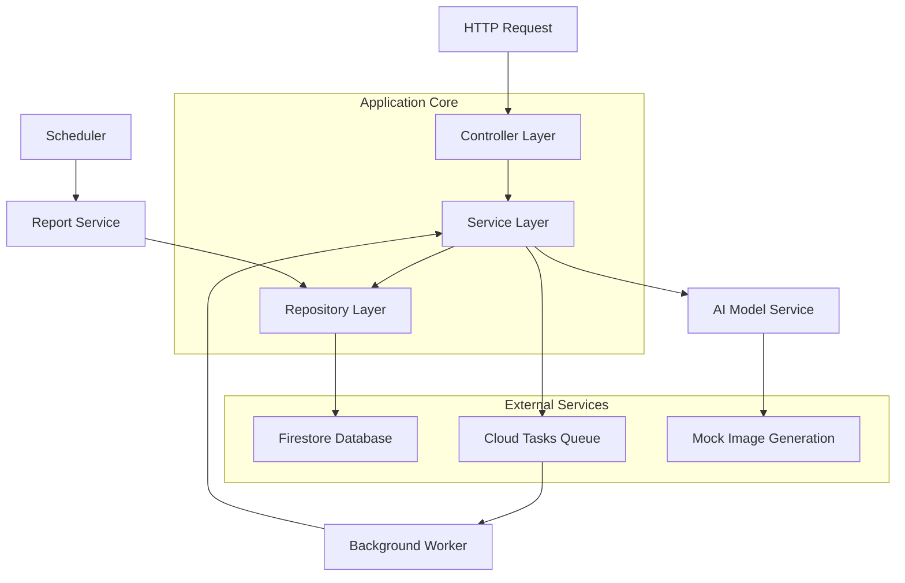

# Feraset AI Image Generation API

This project features a credit-based system, asynchronous task processing using Cloud Tasks, and automated weekly analytics.

-----

## 📋 Table of Contents

- [✨ Key Features](#-key-features)
- [🌐 Live Demo & Postman](#-live-demo--postman)
- [🏗️ System Architecture](#️-system-architecture)
  - [📊 Architecture Diagram](#-architecture-diagram)
  - [📁 Directory Structure](#-directory-structure)
- [⚙️ Prerequisites & Setup](#️-prerequisites--setup)
  - [🛠️ Required Tools](#️-required-tools)
  - [📦 Installing Dependencies](#-installing-dependencies)
  - [🔥 Initialize Firebase Emulator](#-initialize-firebase-emulator)
- [🔧 Configuration & Environment Variables](#-configuration--environment-variables)
  - [🌍 Environment Variables](#-environment-variables)
  - [📄 Config File](#-config-file)
- [🚀 Running Locally](#-running-locally)
  - [▶️ Start the Emulator Suite](#️-start-the-emulator-suite)
  - [🌱 Seed the Database](#-seed-the-database)
  - [💻 Sample API Commands](#-sample-api-commands)
- [📚 API Reference](#-api-reference)
  - [🎯 Core Endpoints](#-core-endpoints)
  - [📝 Request/Response Examples](#-requestresponse-examples)
- [🗄️ Database Schema](#️-database-schema)
  - [📂 Collections Structure](#-collections-structure)
- [🧪 Testing](#-testing)
  - [▶️ Running Tests](#️-running-tests)
  - [📊 Test Coverage](#-test-coverage)
  - [🎭 Mocking Strategy](#-mocking-strategy)
- [📈 Monitoring & Analytics](#-monitoring--analytics)
  - [📊 Weekly Reports](#-weekly-reports)
  - [🚨 Anomaly Detection Thresholds](#-anomaly-detection-thresholds)
- [🔍 Troubleshooting](#-troubleshooting)
  - [⚠️ Common Issues](#️-common-issues)
  - [🐛 Debugging](#-debugging)
- [💡 Design Choices & Future Improvements](#-design-choices--future-improvements)

-----

## ✨ Key Features

  * **Credit System**: Users spend credits to generate images. Costs vary by image size.
  * **Asynchronous Jobs**: Image generation is handled in the background by **Google Cloud Tasks**, so users don't have to wait.
  * **AI Model Simulation**: The system simulates two different AI models with a 5% failure rate to mimic real-world conditions.
  * **Analytics & Reporting**: A scheduled function runs weekly to generate usage reports and detect unusual activity (anomalies).
  * **Clean Architecture**: The code is organized into separate layers (Controllers, Services, Repositories) to make it easy to manage and test.
  * **Data Validation**: Uses Pydantic models to make sure all data is correct and secure.

-----

## 🌐 Live Demo & Postman

You can test the API using the live demo or the Postman collection.

  * **Live API Demo UI**: [feraset-api.altinors.com](https://feraset-api.altinors.com/)
  * **Postman Collection**: [View on Postman](https://www.google.com/search?q=https://www.postman.com/altinors/feraset-imagen/collection/1rwqfmm/feraset-imagen-api-collection) OR [download collection](https://github.com/ardaaltinors/feraset-imagen/blob/main/docs/postman_collection.json)
-----

## 🏗️ System Architecture

The project follows a clean architecture pattern, separating responsibilities into different layers. When a user requests an image, the request goes through the **Controller**, which calls the **Service** layer for business logic. The Service layer then uses the **Repository** to talk to the **Firestore** database.

For long-running tasks like generating an image, the service adds a job to a **Cloud Tasks** queue. A separate background worker function picks up this job, processes it, and updates the status in Firestore.

## 📊 Architecture Diagram



### 📁 Directory Structure

```
functions/
├── main.py                # Main entrypoint for all Cloud Functions
├── controllers/           # Handles incoming HTTP requests
├── services/              # Contains the core business logic
├── repositories/          # Manages all database operations
├── schemas/               # Pydantic models for data validation
├── core/                  # Shared configuration and utilities (CORS, logging)
├── tests/                 # Unit and integration tests
└── utils/                 # Helper functions
```

## ⚙️ Prerequisites & Setup

### 🛠️ Required Tools

- **Python 3.13+**
- **Firebase CLI** (`npm install -g firebase-tools`)
- **Git** for version control

### 📦 Installing Dependencies

```bash
# Navigate to functions directory
cd functions

# Create and activate virtual environment (recommended)
python -m venv venv
source venv/bin/activate  # On Windows: venv\Scripts\activate

# Install production dependencies
pip install -r requirements.txt

# Install test dependencies (for development)
pip install -r test-requirements.txt
```

### 🔥 Initialize Firebase Emulator

```bash
# Start Firebase emulator suite (from root directory)
firebase emulators:start

# Alternative: Start with existing data 
# (or you can use seeder endpoint later)
firebase emulators:start --import=./docs/firestore-export
```

## 🔧 Configuration & Environment Variables

### 🌍 Environment Variables

- Rename the `.env.example` to `.env` in `functions/` directory.
- Set this to true:

```bash
RUNNING_ON_EMULATOR=true
```

### 📄 Config File

- Check `/functions/core/config.py` for additional configuration such as anomaly detection.

## 🚀 Running Locally

### ▶️ Start the Emulator Suite

```bash
firebase emulators:start
```

### 🌱 Seed the Database

```bash
# Seed realistic historical data
curl -X POST "http://127.0.0.1:5551/feraset-imagen/us-central1/seed_database"
```

### 💻 Sample API Commands

```bash
# Get user credits
curl "http://127.0.0.1:5551/feraset-imagen/us-central1/getUserCredits?userId=arda"

# Create generation request
curl -X POST "http://127.0.0.1:5551/feraset-imagen/us-central1/createGenerationRequest" \
  -H "Content-Type: application/json" \
  -d '{
    "userId": "arda",
    "model": "Model A",
    "style": "realistic",
    "color": "vibrant",
    "size": "1024x1024",
    "prompt": "A beautiful landscape"
  }'

# Check generation status
curl "http://127.0.0.1:5551/feraset-imagen/us-central1/getGenerationStatus?generationRequestId=gen_123"
```

## 📚 API Reference

- You can check the [Postman Collection](https://www.postman.com/altinors/feraset-imagen/collection/1rwqfmm/feraset-imagen-api-collection?action=share&creator=42658830&active-environment=42658830-a4aef782-ba47-4189-be24-62a4d91f03eb), or even use the test UI at: https://feraset-api.altinors.com/

### 🎯 Core Endpoints

| Method | Endpoint | Description |
|--------|----------|-------------|
| POST | `/api/createGenerationRequest` | Create new image generation request |
| GET/POST | `/api/getGenerationStatus` | Check generation progress |
| GET/POST | `/api/getUserCredits` | Get user credits and transactions |
| POST | `/api/seed_database` | Seed database with test data |

### 📝 Request/Response Examples

**Create Generation Request:**
```json
// Request
{
  "userId": "arda",
  "model": "Model A",
  "style": "realistic",
  "color": "vibrant",
  "size": "512x512",
  "prompt": "A beautiful sunset"
}

// Response (202 Accepted)
{
    "generationRequestId": "9aa7d824-d7d4-4bcd-888b-27b5623cd253",
    "status": "queued",
    "deductedCredits": 1,
    "queuePosition": null
}
```

**Generation Status:**
```json
// Response
{
    "generationRequestId": "9aa7d824-d7d4-4bcd-888b-27b5623cd253",
    "status": "completed",
    "imageUrl": "https://placeholder-images-model-a.example.com/generated/9aa7d824-d7d4-4bcd-888b-27b5623cd253?model=model_a&style=realistic&color=vibrant&size=512x512&timestamp=1754313266",
    "error_message": null,
    "progress": 100.0,
    "created_at": "2025-08-04 13:14:01.706777+00:00",
    "updated_at": "2025-08-04 13:14:26.757346+00:00",
    "completed_at": "2025-08-04 13:14:26.757332+00:00"
}
```

## 🗄️ Database Schema

### 📂 Collections Structure

```
users/
  {userId}/
    - name, email, current_credits
    - total_images_generated, created_at
    transactions/  (subcollection)
      {transactionId}/
        - type: "deduction"/"refund"
        - credits, generation_request_id
        - timestamp, description

generation_requests/
  {requestId}/
    - user_id, model, style, color, size
    - status, credits_deducted, image_url
    - created_at, updated_at, completed_at

styles/
  {styleId}/ - display_name, description, sort_order

colors/
  {colorId}/ - display_name, hex_examples

sizes/  
  {sizeId}/ - width, height, credit_cost, aspect_ratio

reports/
  {reportId}/ - week_start, total_requests, anomalies
```

## 🧪 Testing

### ▶️ Running Tests

```bash
# Run all tests
cd functions
pytest

# Run specific test categories
pytest tests/test_credit_operations.py              # Unit tests
pytest tests/integration/test_credit_workflows.py  # Integration tests
```

### 📊 Test Coverage

**Unit Tests** (`test_credit_operations.py`):
- ✅ Credit deduction with sufficient/insufficient credits
- ✅ Atomic credit refund operations
- ✅ User validation and existence checks
- ✅ Credit cost calculations for different sizes

**Integration Tests** (`integration/`):
- ✅ Complete generation workflows (success/failure)
- ✅ Background task processing with Cloud Tasks
- ✅ End-to-end credit management with transaction history
- ✅ User credit retrieval with full audit trails

### 🎭 Mocking Strategy

The test suite uses comprehensive mocking for Firebase services:
- **Firebase Admin SDK**: Auto-mocked in `conftest.py`
- **Firestore Operations**: Mock collections, documents, and batch operations
- **Atomic Transactions**: Verified transaction isolation and rollback
- **Cloud Tasks**: Mocked queue operations and task payloads


## 📈 Monitoring & Analytics

### 📊 Weekly Reports

Automated weekly reports (Mondays 20:25 UTC) include:
- Total requests and credit consumption
- User activity patterns and new registrations
- Model performance and failure rates
- **Anomaly Detection**: Usage spikes, high failure rates, suspicious patterns

### 🚨 Anomaly Detection Thresholds

- **Request Spikes**: 2.5x historical average
- **Credit Usage**: 3.0x historical average  
- **Failure Rate**: >15%
- **Single User**: >50 credits/day
- **New Users**: >5 registrations/day


## 🔍 Troubleshooting

### ⚠️ Common Issues

**Tasks Stuck at Queued**: Make sure you have set `RUNNING_ON_EMULATOR=false` in `.env`

### 🐛 Debugging

```bash
# Check emulator logs
firebase emulators:start --debug

# View function logs
firebase functions:log

# Check Firestore data
# Visit http://127.0.0.1:4000 for emulator UI
```

---

## 💡 Design Choices & Future Improvements

Here are some technical decisions made during development and potential improvements for the future.

**Asynchronous Processing**: I used Google Cloud Tasks to handle image generation in the background. This was an extra step not required by the task, but it creates a much better user experience because the API responds instantly.

*Future Improvement*: For a real application, I'd use Firebase Cloud Messaging (FCM) to send a push notification to the client when an image is ready, instead of requiring the client to repeatedly ask for the status with the getGenerationStatus endpoint.

**Data Management**: To save development time, I didn't create API endpoints for managing styles, colors, or sizes. Instead, this data is added directly to the database using the seed_database function. In a larger system, these would have their own CRUD endpoints.

**Error Handling**: Exception handling is currently done within each controller.

*Future Improvement*: I would implement a global exception handling middleware. This would centralize all error logic, reduce code duplication, and ensure that all API errors have a consistent and predictable format.

---

**Built with Firebase Functions, Firestore, Cloud Tasks, and Python 3.13**